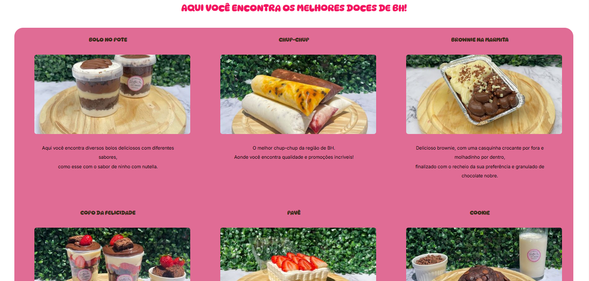

<h1 align="center"> Gulla Doces </h1>

  <a href="#-tecnologias">Tecnologias</a>&nbsp;&nbsp;&nbsp;|&nbsp;&nbsp;&nbsp;
  <a href="#-projeto">Projeto</a>&nbsp;&nbsp;&nbsp;|&nbsp;&nbsp;&nbsp;
  <a href="#-layout">Layout</a>&nbsp;&nbsp;&nbsp;|&nbsp;&nbsp;&nbsp;
  <a href="#memo-licença">Licença</a>

  

 

  

## 🚀 Tecnologias

Esse projeto foi desenvolvido com as seguintes tecnologias:

- HTML 
- CSS
- Git 
- Github

## 💻 Projeto

O Gulla Doces é um cardapio ilutrativo para os clientes.

- [Acesse o projeto finalizado, online]( https://pablohenrique9362.github.io/Projeto-Gulla-Doces)

## :memo: Licença

Esse projeto está sob a licença MIT.

---
Feito com ♥ por Pablo!!
